# Senior Project: Voice-First Accessible Personal Assistant

> **Voice-first, accessible personal assistant designed specifically for elderly Thai individuals within the native LINE messaging app.**

---

## 📖 System Vision & Overview

The project provides an intuitive personal assistant for elderly Thai users to manage alarms, reminders, and voice notes with zero learning curve. By embedding directly inside LINE, it eliminates the barrier of downloading and navigating standalone applications.

### Key Pillars

- **Zero-Friction Interface:** Natural Thai voice messaging in LINE, complemented by a persistent Rich Menu and an accessible visual LIFF dashboard.
- **Elderly-Focused AI Persona:** Respectful, warm, patient, and polite Thai phrasing (ครับ/ค่ะ), avoiding robotic jargon or condescending baby talk.
- **Dual AI Architecture:** Separates conversational empathy (Gemini 3.5 Flash-Lite) from deterministic intent classification and parameter extraction (TypeSafe AI Jev model).
- **Three-Tier Persistent Memory:** Short-term conversational context, rolling daily summaries, and long-term learned user facts stored in Firestore.
- **Elderly-Accessible UI:** LIFF dashboard adhering to senior usability standards (minimum 16px/1rem text, 20px base font, and minimum 48px touch targets).

---

## 🏗️ Architecture & Component Topology

```mermaid
flowchart TB
    subgraph ClientLayer["Client & User Touchpoints"]
        User["👴 Elderly User"]
        LineApp["LINE Native App"]
        RichMenu["LINE Rich Menu (Persistent Footer)"]
        LiffApp["LIFF Webview (Card Dashboard)"]
    end

    subgraph GatewayLayer["Ingress & Edge Services (Vercel)"]
        WebhookRoute["/api/webhook (LINE Events Ingress)"]
        NotifyRoute["/api/notify (Cloud Tasks Dispatch Ingress)"]
        LiffApi["/api/liff/* (Dashboard Data Read/Write)"]
        AuthRoute["/api/auth/line (Token Exchange)"]
    end

    subgraph SpeechLayer["Speech Processing"]
        LineBlob["LINE Media CDN (Blob Storage)"]
        CloudSTT["Google Cloud Speech-to-Text v2\n(Chirp Engine: th-TH, en-US)"]
    end

    subgraph IntelligenceLayer["Dual AI Stack"]
        Gemini["Gemini 3.5 Flash-Lite\n(Conversational Generation)"]
        Jev["TypeSafe AI (Jev Model)\n(Deterministic Intent Classifier)"]
    end

    subgraph StorageAndSchedulingLayer["Data Persistence & Background Jobs"]
        Firestore["Google Cloud Firestore\n(Users, Reminders, Alarms, Notes, History)"]
        CloudTasks["Google Cloud Tasks\n(Distributed Delayed Queue)"]
        FirebaseAuth["Firebase Authentication\n(Custom Token Authority)"]
    end

    User -->|Sends Voice/Text| LineApp
    User -->|Taps Menu Button| RichMenu
    RichMenu -->|Launches| LiffApp
    LiffApp -->|Interacts| User

    LineApp -->|Webhooks via HTTPS| WebhookRoute
    WebhookRoute -->|Fetches Audio Stream| LineBlob
    WebhookRoute -->|Sends Audio Bytes| CloudSTT
    CloudSTT -->|Returns Transcript| WebhookRoute

    WebhookRoute -->|Context & Chat History| Firestore
    WebhookRoute -->|Natural Dialogue Prompt| Gemini
    Gemini -->|Proposed Text & Intent Draft| WebhookRoute
    WebhookRoute -->|Parallel Choice/Noul Validation| Jev
    Jev -->|Validated Intent / Tool ID| WebhookRoute

    WebhookRoute -->|Persist New Alarm/Reminder/Note| Firestore
    WebhookRoute -->|Enqueues Timed Push Notification| CloudTasks
    WebhookRoute -->|Direct Reply / Push Flex Card| LineApp

    CloudTasks -->|Triggers at Scheduled Time| NotifyRoute
    NotifyRoute -->|Checks Document & Recurrence| Firestore
    NotifyRoute -->|Sends Interactive Push Alert| LineApp

    LiffApp -->|REST Calls| LiffApi
    LiffApp -->|Authenticate| AuthRoute
    AuthRoute -->|Exchange LINE Identity| FirebaseAuth
    LiffApi -->|Query / Mutate User Data| Firestore
```



---

## 🔄 End-to-End Information Flows

### 1. Voice Interaction Pipeline (Incoming Request)

1. **User Vocalization:** User speaks in Thai into LINE voice notes (AAC/m4a).
2. **Webhook Receipt & Ingress:**
   - Ingress endpoint (`/api/webhook`) verifies `X-Line-Signature` (HMAC-SHA256).
   - Responds immediately with `200 OK` to prevent LINE retry storms.
   - Dispatches remaining compute asynchronously via Next.js `after()`.
3. **Voice Decoding & STT:**
   - Streams audio buffer from LINE Blob API.
   - Transcribes Thai audio using Google Cloud Speech-to-Text v2 Chirp engine (`asia-southeast1`).
4. **Context Assembly:**
   - Loads 3-tier memory from Firestore (profile facts, daily summary, recent messages).
5. **Dual Cognitive Processing:**
   - **Gemini 3.5 Flash-Lite:** Generates warm conversational Thai reply.
   - **TypeSafe AI (Jev):** Deterministically validates intent and extracts parameters with zero schema hallucination.
6. **Execution & Delivery:**
   - Persists alarm, reminder, or note in Firestore.
   - Enqueues scheduled job in Google Cloud Tasks if applicable.
   - Pushes interactive LINE Flex Message card to the user.

### 2. Scheduled Notification & Recurrence

1. At scheduled timestamp, Google Cloud Tasks issues a secure POST request to `/api/notify`.
2. Validates `X-Webhook-Secret` header.
3. Sends actionable Flex Message card with Snooze and Done buttons.
4. Evaluates recurrence rules (daily/weekly/monthly in `Asia/Bangkok`), computes next firing instant, updates Firestore, and re-enqueues next task.

---

## 🏛️ Architecture Decision Records (ADRs)

| Component         | Technology                              | Rationale                                                                                  |
| ----------------- | --------------------------------------- | ------------------------------------------------------------------------------------------ |
| **Interface**     | Native LINE OA + LIFF                   | Eliminates mobile app install barrier; Thai elders already use LINE daily.                 |
| **Runtime**       | Next.js App Router on Vercel            | Scalable serverless compute; Next.js `after()` enables background async pipelines.         |
| **STT Engine**    | Google Cloud STT v2 (Chirp)             | High transcription accuracy for Thai tonal phonetics in `asia-southeast1`.                 |
| **AI Stack**      | Gemini + TypeSafe Jev Dual Architecture | Gemini provides natural Thai persona dialogue; Jev ensures 0% schema error intent routing. |
| **Scheduler**     | Google Cloud Tasks                      | Supports individual timestamp execution (up to 30 days) and automated retries.             |
| **Database**      | Cloud Firestore                         | Hierarchical per-user subcollections (`alarms`, `reminders`, `notes`, `messages`).         |
| **Design System** | Tailwind CSS v4 Elder Tokens            | Minimum 16px text, 20px base font, 48px touch targets, high contrast.                      |

---

## 🛠️ Project Structure

```
senior-project/
├── .github/workflows/
│   ├── ci.yml                   # Automated CI pipeline
│   ├── lint-pr.yml              # Conventional PR title validation
│   └── release.yml              # Automated semantic-release on main
├── .env.example                 # Environment template
├── .gitignore                   # Excludes plans, build artifacts, envs
├── .prettierrc                  # Prettier code formatting rules
├── messages/                    # next-intl translation catalogs
│   ├── th.json                  # Thai messages
│   └── en.json                  # English messages
├── public/                      # Static assets
├── src/
│   ├── app/
│   │   ├── globals.css          # Senior typography and base styles
│   │   ├── layout.tsx           # Root HTML layout
│   │   ├── page.tsx             # Root redirect to /th/liff
│   │   └── [locale]/            # Localized App Router segment
│   │       ├── layout.tsx       # NextIntlClientProvider wrapper
│   │       └── page.tsx         # Localized dashboard landing
│   ├── lib/
│   │   ├── firebase/            # Firebase Admin singleton & collections
│   │   └── i18n/                # Locale config and request resolver
│   ├── middleware.ts            # next-intl routing middleware
│   └── types/
│       ├── firestore.ts         # Document schemas
│       └── jev.ts               # Intent classification types
├── next.config.ts               # Next.js configuration
├── package.json                 # pnpm dependencies and scripts
├── release.config.js            # Semantic release rules and plugins
├── tailwind.config.ts           # Elder design system tokens
├── tsconfig.json                # TypeScript strict configuration
└── vitest.config.ts             # Vitest test runner configuration
```

---

## 🚀 Getting Started

### Prerequisites

- Node.js `>= 20` (Node 22 LTS recommended)
- `pnpm` `>= 9` (`pnpm 11+` supported)

### Installation

```bash
pnpm install
```

### Available Scripts

```bash
pnpm dev             # Start local development server (http://localhost:3000)
pnpm build           # Build production application
pnpm type-check      # Run TypeScript type validation
pnpm format:check    # Check code style with Prettier
pnpm format          # Format codebase with Prettier
pnpm test            # Run Vitest test runner
pnpm test:run        # Run all unit tests once
```
